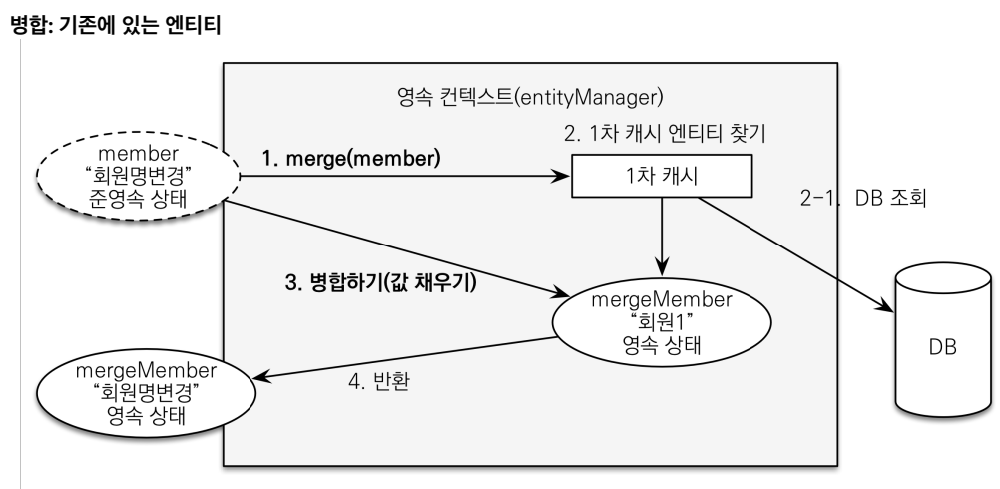

# ⭐ 준영속 상태

- 영속 → 준영속
- 영속 상태의 엔티티가 영속성 컨텍스트에서 분리
- 영속성 컨텍스트가 제공하는 기능을 사용 못함

### 준영속 상태로 만드는 방법

- em.detach()

  특정 엔티티만 준영속 상태로 전환

- em.clear()

  영속성 컨텍스트를 완전히 초기화

- em.close()

  영속성 컨텍스트 종료

- 직접 만들기

    ```java
    // given
    Book book = new Book("a",1000);
    em.persist(book);
    em.flush();
    em.clear();
    // 직접 준영속 상태 만들기
    Book detachedBook = new Book(book.getId(),"b",null);
    ```


### 🔥 변경 감지와 병합

엔티티를 수정하는 방법

- 변경 감지 기능 사용

```java
@Transactional
void update(Item itemParam) {
	Item findItem = em.find(Item.class, itemParam.getId());
	findItem.setPrice(itemParam.getPrice());
}
```

영속성 컨텍스트에서 엔티티를 다시 조회한 후에 데이터를 수정하는 방법

트래잭션 안에서 엔티티를 조회 후 변경할 값 선택 → 더티 체킹

- 병합 사용

merge는 준영속 상태의 엔티티를 영속 상태로 변경할 때 사용하는 기능이다.

merge는 준영속 상태의 엔티티인지 확인한다. 내부적으로 em.find를 통해 영속 상태인 값을 찾거나 없으면 데이터 베이스 조회를 통해서 영속 상태인 객체를 찾는다. 그 후 준영속 상태인 객체의 내부 상태를 그대로 복사한다. find → merge



```java
@Transactional
void update(Item itemParam) {
	Item mergeItem = em.merge(itemParam);
}
```

```java
// given
Book book = new Book("a",1000);
em.persist(book);
em.flush();
em.clear();
System.out.println("준비 끝===============");
// when
Book detachedBook = new Book(book.getId(),"b",null);
Book mergeBook = em.merge(detachedBook);
System.out.println("머지 완료=============");
// then
em.flush();
em.clear();
```

❌ 변경 감지 기능을 사용하면 원하는 속성만 선택해서 변경할 수 있지만, 병합을 사용하면 모든 속성이 변경된다. 병합시 값이 없으면 null로 업데이트할 위험도 있다. 그러니 엔티티를 변경할 때는 항상 변경 감지를 사용하자!

추가적으로 Spring Data Jpa의 save는 내부적으로 merge 방식을 사용한다. 그러니 주의해서 사용해야한다.


# ❌ 페치 조인 한계

- 페치 조인 대상을 별칭을 줘서 조건문으로 걸러서 가져오지 않기

    ```sql
    SELECT t FROM Team t JOIN FETCH t.members m where m.age > 10;
    ```

- 컬렉션을 페치 조인(OneToMany) 하면 페이징 API(setFirstResult, setMaxResults) 를 사용할 수 없다.
  - 일대일, 다대일 같은 단일 값 연관 필드들은 페치 조인해도 페이징 가능
  - 하이버 네이트는 경고 로그를 남기고 메모리에서 페이징

    ```sql
    List<Team> teams = em.createQuery("select t from Team t left join fetch t.members m", Team.class)
             .setFirstResult(0)
             .setMaxResults(2)
             .getResultList();
    System.out.println("======================");
    for (Team team : teams) {
         System.out.println("팀 + "+team.getName());
         for (Member2 member : team.getMembers()) {
                System.out.println("member = "+member.getName());
         }
    }
    /*
    5월 21, 2025 2:05:05 오후 org.hibernate.query.sqm.internal.AbstractSqmSelectionQuery errorOrLogForPaginationWithCollectionFetch
    WARN: HHH90003004: firstResult/maxResults specified with collection fetch; applying in memory
    */
    Hibernate: 
    			 select
                t1_0.id,
                m1_0.team_id,
                m1_0.id,
                m1_0.name,
                t1_0.name 
            from
                Team t1_0 
            left join
                Member2 m1_0 
                    on t1_0.id=m1_0.team_id
    ======================
    팀 + a
    member = a
    member = b
    팀 + b
    member = c
    ```

  - 해결 방법(betch_size 사용)

  원래 해결 방법은 fetch join을 사용하지 않고 단일로 불러와야한다.

    ```sql
    List<Team> teams = em.createQuery("select t from Team t", Team.class)
             .setFirstResult(0)
             .setMaxResults(2)
             .getResultList();
    System.out.println("======================");
    for (Team team : teams) {
         System.out.println("팀 + "+team.getName());
         for (Member2 member : team.getMembers()) {
                System.out.println("member = "+member.getName());
         }
    }
    
    Hibernate: 
        /* select
            t 
        from
            Team t */ select
                t1_0.id,
                t1_0.name 
            from
                Team t1_0 
            offset
                ? rows 
            fetch
                first ? rows only
    ======================
    팀 + a
    Hibernate: 
        select
            m1_0.team_id,
            m1_0.id,
            m1_0.name 
        from
            Member2 m1_0 
        where
            m1_0.team_id=?
    member = a
    member = b
    팀 + b
    Hibernate: 
        select
            m1_0.team_id,
            m1_0.id,
            m1_0.name 
        from
            Member2 m1_0 
        where
            m1_0.team_id=?
    member = c
    ```

  하지만 이렇게 하면 N+1 문제가 발생하게 된다.

  이를 해결하고자 BATCHSIZE를 사용한다.

    ```sql
    @Entity
    public class Team {
        @Id
        @GeneratedValue(strategy = GenerationType.IDENTITY)
        private Long id;
        @BatchSize(size = 10)
        @OneToMany(mappedBy = "team")
        private List<Membe> members = new ArrayList<>();
    }
    
    List<Team> teams = em.createQuery("select t from Team t", Team.class)
             .setFirstResult(0)
             .setMaxResults(2)
             .getResultList();
    System.out.println("======================");
    for (Team team : teams) {
         System.out.println("팀 + "+team.getName());
         for (Member2 member : team.getMembers()) {
                System.out.println("member = "+member.getName());
         }
    }
    
    Hibernate: 
        /* select
            t 
        from
            Team t */ select
                t1_0.id,
                t1_0.name 
            from
                Team t1_0 
            offset
                ? rows 
            fetch
                first ? rows only
    ======================
    팀 + a
    Hibernate: 
        select
            m1_0.team_id,
            m1_0.id,
            m1_0.name 
        from
            Member2 m1_0 
        where
            m1_0.team_id in (?, ?, ?, ?, ?, ?, ?, ?, ?, ?)
    member = a
    member = b
    팀 + b
    member = c
    ```

  # 🤔 벌크 연산

  재고가 10개 미만인 모든 상품의 가격을 10% 상승시킨다면?

  변경 감지로 변경하려면 10개 미만인 상품을 모두 가져와서 변경 감지 기능을 사용한다. 만약 변경된 데이터가 100건 이라면 100번의 update sql 실행한다.

  - 해결 방안

    ```sql
    // 처음 맴버의 나이는 모두 null이라고 가정
    em.createQuery("update Member2 m set m.age = 10")
             .executeUpdate();
    System.out.println(member1.getAge());
    System.out.println(member2.getAge());
    System.out.println(member3.getAge());
    Member member = em.find(member1.getId());
    System.out.println(member.getAge());
    /*
    null -> 실제 데이터 베이스에는 나이가 10으로 저장되어 있지만 영속성 컨텍스트에는 반영을 안함
    null -> 그렇기에 무조건 영속성 컨텍스트를 한번 비워야함
    null
    null
    */
    ```

  Spring Data Jpa를 사용하면 @Modifying, @Query 를 사용해서 해결함