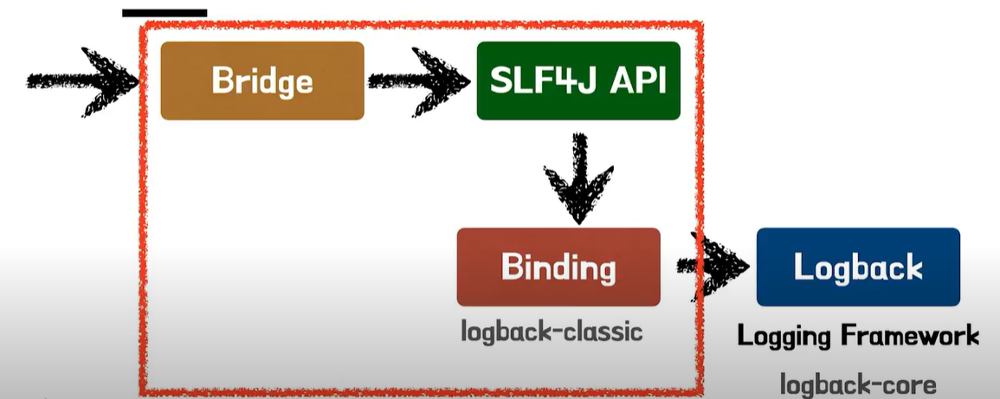
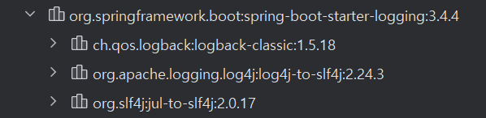

# ⭐ Spring Rest Docs
# 개념

| 개념 | 설명 |
| --- | --- |
| **Snippets** | 테스트 중에 생성되는 **문서 조각들**. 예: request, response, curl 명령어 등 |
| **Asciidoctor** | `.adoc` 문서 작성 언어를 HTML 등으로 변환해주는 도구 |
| **Spring REST Docs** | Spring의 테스트 코드와 함께 사용해서 **문서 스니펫 생성** |
| **.adoc 파일** | Asciidoc 문법으로 쓰인 API 설명서 템플릿(개발자가 Snippets를 조합해서 작성) |
| **HTML 문서** | `.adoc`과 snippets를 결합하여 최종적으로 생성되는 API 문서 |
| **Gradle 설정** | `asciidoctor` 플러그인과 task를 통해 위 작업을 자동화 |
| RestDocumentationResultHandler | MockMvc 테스트 결과로부터 문서 조각을 생성하도록 도와주는 핸들러 |

# Build Gradle

```java
plugins {
    id "org.asciidoctor.jvm.convert" version "3.3.2" -- (1) asciidoctor 플러그인 추가
}

configurations {
    asciidoctorExt -- (2) asciidoctorExt 구성 추가
}

dependencies {
    asciidoctorExt 'org.springframework.restdocs:spring-restdocs-asciidoctor' -- (3) asciidoctorExt 의존성 추가
    testImplementation 'org.springframework.restdocs:spring-restdocs-mockmvc' -- (4) spring-restdocs-mockmvc 의존성 추가
}

ext {
    snippetsDir = file('build/generated-snippets') -- (5)
}

test {
    outputs.dir snippetsDir -- (6)
}

asciidoctor { 
    configurations 'asciidoctorExt' -- (7)
    baseDirFollowsSourceFile() -- (8)
    inputs.dir snippetsDir -- (9)
    dependsOn test -- (10)
}

asciidoctor.doFirst {
    delete file('src/main/resources/static/docs') -- (11)
}

tasks.register('copyDocument', Copy) { -- (12)
    dependsOn asciidoctor
    from file("build/docs/asciidoc")
    into file("src/main/resources/static/docs")
}

bootJar {
    dependsOn copyDocument -- (13)
    from ("${asciidoctor.outputDir}") {
        into 'static/docs'
    }
}
```

1. Asciidoctor 파일을 컨버팅 하고 Build 폴더에 복사하기 위한 플러그인
2. asciidoctorExt 구성 추가
3. adoc 파일에서 사용할 snippets 속성이 자동으로 build/generated-snippets를 가리키도록 해줌. 즉, 테스트가 통과하고 snippet 파일들이 이걸 가리키도록 해준다.
4. spring-restdocs-mockmvc 의존성 추가
5. snippets 파일이 저당될 경로 snippetsDir로 변수 설정
6. 출력할 디렉토리를 snippertsDir로
7. Asciidoctor에서 asciidoctorExt 설정 사용
8. .adoc 파일에서 다른 .adoc를 include하여 사용하는 경우 경로를 동한 경로를 baseDir로 동일하게 설정
9. 입력할 디렉토리를 snippetsDir로 설정
10. Gradle build 시 test → asciidoctor 순으로 진행된다.
11. asciidoctor가 실행될 때 처음으로 해당 경로에 있는 파일들을 지운다.
12. 실행 task를 정의하고 type을 복사로 정의 from에 위치한 파일들을 into로 복사
13. Gradle build시 createDocument → bootJar 순으로 진행된다.
14. Gradle build시 asciidoctor.outputDir에 Html 파일이 생기고 이걸을 jar 안에 /resources.static 폴더에 복사

## 예시 코드(MockMvc 적용하기)

```java
@TestConfiguration
public class RestDocsConfig {

    @Bean
    public RestDocumentationResultHandler write() {
        return MockMvcRestDocumentation.document(
                "{class-name}/{method-name}",
                Preprocessors.preprocessRequest(Preprocessors.prettyPrint()),
                Preprocessors.preprocessResponse(Preprocessors.prettyPrint())
        );
    }
}

@Import({RestDocsConfig.class})
@WebMvcTest(MemberController.class)
@ExtendWith(RestDocumentationExtension.class)
public class MemberControllerDocsTest {
		// 주입 ...
    @Autowired
    private RestDocumentationResultHandler restDocs;

    @Autowired
    private ObjectMapper objectMapper;

    private MockMvc mockMvc;

    @BeforeEach
    void setUp(
            WebApplicationContext webApplicationContext,
            RestDocumentationContextProvider provider
    ) {
        mockMvc = MockMvcBuilders.webAppContextSetup(webApplicationContext)
                .apply(documentationConfiguration(provider)
                        .uris()
                        .withScheme("http")
                        .withHost(ip)
                        .withPort(port))
                .alwaysDo(restDocs)
                .build();
    }

    @Test
    void signUp() throws Exception {
        when(memberService.signup(any()))
                .thenReturn(new SignUpResponse(1L));
        SignupRequest request = new SignupRequest("ind07152@naver.com", "asd", "cogi");
        SignUpResponse response = new SignUpResponse(1L);

        mockMvc.perform(RestDocumentationRequestBuilders.post("/members")
                        .content(objectMapper.writeValueAsString(request))
                        .contentType(MediaType.APPLICATION_JSON))
                .andExpectAll(
                        status().isCreated(),
                        content().json(objectMapper.writeValueAsString(response))
                )
                .andDo(restDocs.document(
                        responseFields(
                                fieldWithPath("id").type(JsonFieldType.NUMBER).description("Member Id")
                        )
                ));
    }
}
```

# Log
# 👨‍💻 테코톡

https://www.youtube.com/watch?v=1MD5xbwznlI

https://www.youtube.com/watch?v=JqZzy7RyudI

## System.out.println()을 왜 안써?

어떤 환경이든 똑같이 동작함!

## 왜 xml  파일로 설정하는가?

설정 xml 파일의 변경을 스캔해 자동으로 재설정 → 자동 리로딩 가능(logback은 설정 파일(`logback.xml`)을 자동으로 감시(watch)하고, 변경되면 다시 읽어들이는 기능이 있음)

만약 자바 코드로 설정하는 경우 재컴파일과 배포가 필요함

### **자동 감지 설정 (`scan="true"`)**

```xml
<configuration scan="true" scanPeriod="30 seconds">
  ...
</configuration>
```

## 로깅

프로그램 동작시 발생하는 모든 일을 기록하는 행위

실제 서버에서는 디버깅이 불가능함

- 서비스 동작 상태
    - 시스템 로딩
    - HTTP 통신
    - 트렌젝션
    - DB 요청
    - 의도를 가진 Exception
        - 회원 가입시 DB에 동일한 email을 가진 회원이 있을 때 DuplicationException을 던진다면 어떤 로그를 찍어야할까? → INFO
- 장애(exception, error)
    - I/O Exception
    - NullPointException
    - 의도하지 않은  Exception

## 로그 레벨

| 레벨 | 설명 |
| --- | --- |
| `TRACE` | 가장 상세한 로그. 변수 값, 메서드 진입/종료 등 디버깅용 |
| `DEBUG` | 디버깅 정보. 상태 변화나 로직 흐름을 보기 좋음 → DEVLEOP |
| `INFO` | 일반적인 운영 정보. 요청 처리, 시작/종료 로그 등 |
| `WARN` | 잠재적인 문제. 현재는 괜찮지만 나중에 문제될 수 있음 → 에러가 될 수 있는 잠재적인 오류, 알람을 통해 개발자가 크리티컬한 오류가 나기전에 막을 수 있음 |
| `ERROR` | 실제 에러 발생. 예외 등으로 인해 처리 실패 → 외부 API |
| `OFF` | 로그 출력 안 함 |

## SLF4J

다양한 로깅 프레임 워크에 대한 추상화 역할



개발 할때는 SLF4J API를 이용하여 로깅 코드를 작성하고

배포 할 때는 바인딩된 Logging Framework가 실제 로깅 코드를 수행한다.

- Bridge : 다른 로깅 API로의 Logger 호출을 SLF4J API로 연결, 이전의 레거시 로깅 프레임워크를 위한 라이브러리, 여러개 사용가능, Binding 모듈에서 사용될 프레임워크와  달라야함 → 어댑터 역할
    - Bridge 추가 설명
        - 만약 기존 코드가 `java.util.logging`, `log4j`를 직접 쓰고 있었다면?
        - SLF4J의 Bridge는 이런 **이전 로깅 API 호출을 SLF4J로 우회시키는 역할**을 해.
        - 즉, **예전 시스템을 새 통역 시스템으로 흡수하는 어댑터**

        ```java
        // binding 모듈은 logback이라고 가정
        import org.apache.logging.log4j.LogManager;
        import org.apache.logging.log4j.Logger;
        
        public class Log4jExample {
            private static final Logger logger = LogManager.getLogger(Log4jExample.class);
        
            public static void main(String[] args) {
                logger.info("Log4j → SLF4J 우회");
            }
        }
        //이 로그는 SLF4J → Logback을 거쳐 최종 출력
        ```

      

- SLF4J API → 로깅에 대한 추상 레이어(인터페이스) 제공, 하나의 API  모듈에 하나의 Binding  모듈, 로깅 동작에 대한 역할을 수행할 추상 메서드를 제공
    - SLF4J API 추가 설명

        ```java
        implementation 'org.slf4j:slf4j-api:2.0.17'
        implementation 'ch.qos.logback:logback-classic:1.4.11'
        implementation 'org.apache.logging.log4j:log4j-slf4j-impl:2.20.0' // ❌ 충돌
        ```

- Binding : SLF4J API를 로깅 구현체와 연결하는 어뎁터 역할, 하나의 API 모듈에 하나의 Binding  모듈

## Logback

### 구조



- logback-core : 다른 두 모듈을 위한 기반 역할을 하는 모듈, Appender와 Layout 인터페이스가 이 모듈에 속함( 로그 메시지를 저장할 방법(Appender: 파일, 콘솔 등)이나, 메시지 형식(Layout)을 정의하는 인터페이스가 여기 포함됨)
- logback-classic은 logback-core에서 확장된 모듈로 logbackl-core를 가지며 SLF4J API를 구현함, Logger 클래스가 이 모듈에 속함
- logback-access: Serlvet Container와 통합하여  HTTP 엑세스에 대한 로깅 기능을 제공, 웹 애플리케이션 레벨이 아닌 컨테이너 레벨에서 설치되야함.
    - logback-access
      Spring Web이나 애플리케이션 레벨 로그가 아닌, **Servlet 컨테이너 자체의 접근 로그**를 남긴다.

      `tomcat`, `jetty` 같은 웹 서버에 직접 연동하여 HTTP 요청 로그를 남긴다.

        ```java
        <!-- logback-access.xml -->
        <configuration>
            <appender name="ACCESS" class="ch.qos.logback.core.ConsoleAppender">
                <layout class="ch.qos.logback.access.PatternLayout">
                    <pattern>%h %l %u %t "%r" %s %b</pattern>
                </layout>
            </appender>
        
            <appender-ref ref="ACCESS"/>
        </configuration>
        
        // 127.0.0.1 - - [09/Jun/2025:13:45:21 +0900] "GET /home HTTP/1.1" 200 5123
        ```


### 설정 요소


- Logger : 실제 로깅을 수행하는 구성요소
    - 출력 레벨 조정

    ```java
    Logger logger = LoggerFactory.getLogger(MyClass.class);
    logger.info("로그 출력!");
    ```

- Appender : 로그 메세지가 출력할 대상 결정(Console Appender, FileAppender, RollingFileAppender 등)
    - `ConsoleAppender` : 터미널에 출력
    - `FileAppender` : 파일에 저장
    - `RollingFileAppender` : 일정 크기/시간마다 파일을 분할
- Layout : Encoder Appender에 포함, 사용자가 지정한 형식으로 표현 될 로그 메시지를 변환하는 역할
    - Encoder는 로그 이벤트를 바이트 배열로 변환하고, 해당 바이트 배열을 OutputStream에 쓰는 작업을 담당함 → logback은 encoder가 layout 역할을 수행한다.
```java
<included>
    <appender name="FILE-WARN" class="ch.qos.logback.core.rolling.RollingFileAppender">
        <file>./log/warn/warn-${DATE}.log</file>
        <filter class="ch.qos.logback.classic.filter.LevelFilter">
            <level>WARN</level>
            <onMatch>ACCEPT</onMatch>
            <onMismatch>DENY</onMismatch>
        </filter>
        <encoder>
            <pattern>${LOG_PATTERN}</pattern>
        </encoder>
        <rollingPolicy class="ch.qos.logback.core.rolling.SizeAndTimeBasedRollingPolicy">
            <fileNamePattern>./backup/warn/warn-%d{yyyy-MM-dd}.%i.log</fileNamePattern>
            <maxFileSize>100MB</maxFileSize>
            <maxHistory>30</maxHistory>
            <totalSizeCap>3GB</totalSizeCap>
        </rollingPolicy>
    </appender>
</included>
```