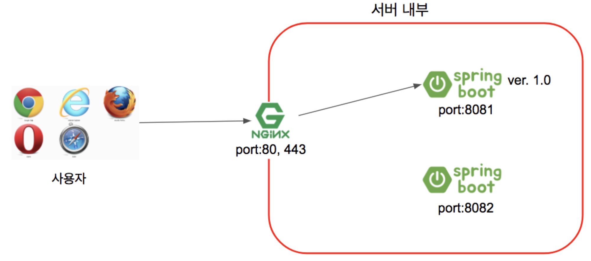
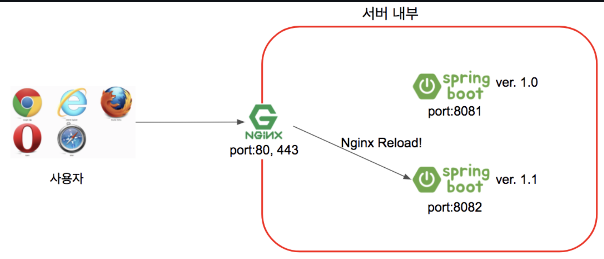
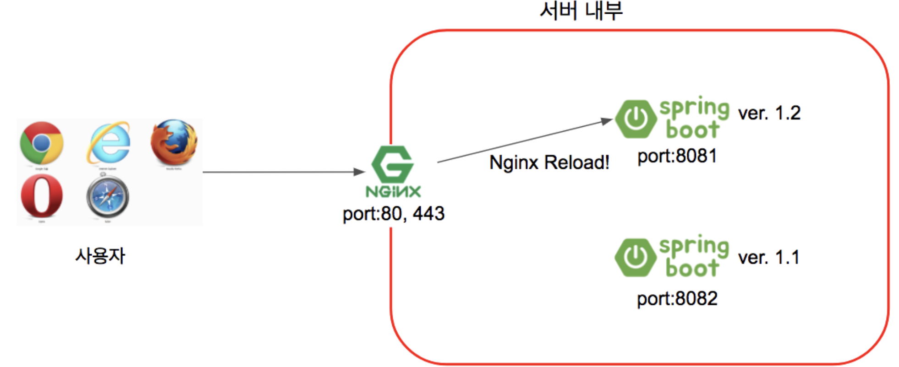
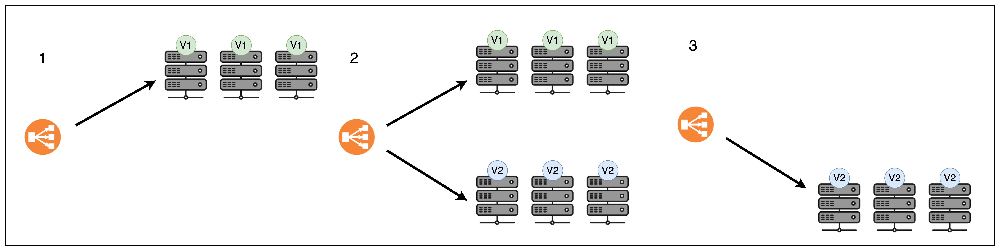
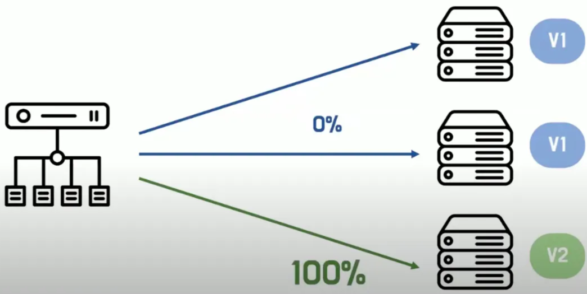
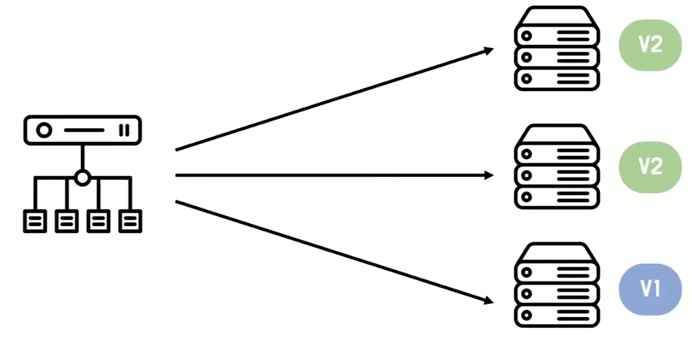

## 무중단 배포

현재의 배포 스크립트는 아래와 같다.

```bash
#!/bin/bash

PROJECT_NAME=spring-roomescape-payment
JAR_NAME=spring-roomescape-payment-0.0.1-SNAPSHOT.jar
SCRIPT_DIR=$(cd "$(dirname "${BASH_SOURCE[0]}")" && pwd)

echo "> Move to project directory"
cd "$SCRIPT_DIR/$PROJECT_NAME" || exit 1

echo "> git pull"
git pull

echo "> project build"
./gradlew clean bootJar
if [ $? -ne 0 ]; then
  echo "> Build failed. Exiting."
  exit 1
fi

echo "> Kill existing application process"
CURRENT_PID=$(pgrep -f $JAR_NAME)
if [ -n "$CURRENT_PID" ]; then
  echo "> Kill process: $CURRENT_PID"
  kill -15 $CURRENT_PID # 프로세스를 한 번 죽임
  sleep 5
fi

echo "> Starting application"

cd build/libs || exit 1

LOG_DIR=logs
mkdir -p $LOG_DIR
LOG_FILE=$LOG_DIR/app.log

nohup java -jar $JAR_NAME --spring.profiles.active=prod --server.port=8080 --server.address=0.0.0.0 > $LOG_FILE 2>&1 &

echo "> Application started with PID: $!"
```

전체적인 배포 스크립트 흐름은

1. 프로젝트 디렉토리로 이동하기
2. 원격 저장소에 있는 내용 pull 해오기
3. 프로젝트 build
4. 기존 애플리케이션 프로세스 죽이기
5. 백그라운드로 애플리케이션 시작

4 → 5 과정에서 프로세스가 죽는 타이밍이 있다.

그럼 새로운 변경 사항을 반영 하기 위해 매번 새로운 배포를 할 때마다 사용자는 저 갭동안 서비스를 사용할 수 없는가?

⇒ 절대 안되는 일!

⇒ 그래서 필요한 것이 **무중단 배포**

### 무중단 배포란?

무중단 배포는 새로운 버전의 애플리케이션을 배포할 때 기존 서비스가 중단되지 않고 사용자에게 계속 제공되는 배포 방식이다.

- 배포 중에도 클라이언트 요청을 정상적으로 처리한다.
- 서버 재시작 또는 애플리케이션 교체가 발생하더라도 오류 없이 전환된다.
- 서비스의 가용성을 유지한다.

### 무중단 배포는 왜 필요할까?

- 서비스 중단 최소화
    - 재시작 시 503 Service Unavailable 오류가 발생 하면 사용자 경험이 저하된다.
- 모니터링과 롤백 가능성 확보
    - 새 버전에서 문제가 생겨도 즉시 이전 버전으로 되돌릴 수 있어야 한다.

### 무중단 배포 원리



- 사용자는 서비스 주소로 접속한다. (80 혹은 443 포트)
- Nginx는 사용자의 요청을 받아 현재 연결된 스프링부트로 요청을 전달한다.
    - 스프링부트1 즉, 8081 포트로 요청을 전달한다고 가정한다.
- 스프링부트2는 Nginx와 연결된 상태가 아니니 요청을 받지 못한다.



- 1.1 버전으로 신규 배포가 필요하면 Nginx와 연결되지 않은 스프링부트2 (8082)로 배포한다.
- 배포하는 동안에도 서비스는 중단되지 않는다.
    - Nginx는 스프링부트1을 바라보기 때문이다.
- 배포가 끝나고 정상적으로 스프링부트2가 구동중인지 확인한다.
- 스프링부트2가 정상 구동중이면 nginx reload를 통해 8081 대신에 8082를 바라보도록 한다.
- Nginx Reload는 1초 이내에 실행 완료 된다.



- 또다시 신규버전인 1.2 버전의 배포가 필요하면 이번엔 스프링부트1로 배포한다.
    - 현재는 스프링부트2가 Nginx와 연결되있기 때문이다.
- 스프링부트1의 배포가 끝났다면 Nginx가 스프링부트1을 바라보도록 변경하고 nginx reload를 실행한다.
- 1.2 버전을 사용중인 스프링부트1로 Nginx가 요청을 전달한다.

**reverse proxy :** nginx가 외부 요청을 받아 뒷 서버로 요청을 전달하는 행위

### 무중단 배포 구현하기

SpringBoot만으로는 불가능하고, AWS 및 배포 전략이 함께 구성 되어야 한다.

**1) Nginx + 배포 스크립트를 이용한 무중단 배포 (Blue-Green Deployment)**

구성 예시

- EC2 1대에 Spring Boot를 실행 (포트 8081, 8082)
- NginX는 reverse proxy로 동작하며, 둘 중 하나를 바라본다.

```bash
# 배포 스크립트 예시 (deploy.sh)
if [ "$CURRENT_PORT" == "8081" ]; then
  NEW_PORT=8082
else
  NEW_PORT=8081
fi

# 새 버전 실행
nohup java -jar -Dserver.port=$NEW_PORT myapp.jar > /dev/null 2>&1 &

# Health Check
until curl -s http://localhost:$NEW_PORT/health | grep 'UP'; do
  sleep 1
done

# Nginx 포워딩 포트 변경
sed -i "s/808[12]/$NEW_PORT/" /etc/nginx/conf.d/service-url.inc
nginx -s reload

# 기존 프로세스 종료
fuser -k $CURRENT_PORT/tcp
```

**2) 무중단 지원 WAS 사용 (Tomcat + Apache/Nginx)**

- Tomcat의 **AJP 커넥터** 또는 **HAProxy/Nginx**와 함께 여러 인스턴스를 운영
- 한 인스턴스씩 순차적으로 배포 → 로드 밸런서에서 제외 후 배포 → 복구 후 다시 등록

**3) Docker + Load Balancer 기반**

- Docker 컨테이너를 Blue-Green 방식으로 운영
- Load Balancer (ALB, Nginx 등)가 두 컨테이너 중 하나만 바라보도록 설정
- 새 컨테이너 실행 → Health check → Load balancer 전환 → 이전 컨테이너 종료

**4) Kubernetes (Rolling Update 전략)**

- Kubernetes Deployment의 RollingUpdate 설정을 통해 자동 무중단 배포 가능

```yaml
strategy:
  type: RollingUpdate
  rollingUpdate:
    maxSurge: 1
    maxUnavailable: 0
```

## **4. 무중단 배포의 방법 종류**

### **1) Blue-Green Deployment**

- 운영(Blue) 서버와 대기(Green) 서버를 두고, 새 버전을 Green에 배포
- 테스트 완료 후 트래픽을 Green으로 전환 → Blue 종료
- 시스템 자원이 충분한 경우 사용하기 유용하다.
- 실제 서비스 환경에서 신버전을 미리 테스트할 수 있다.
- 빠르고 안전한 롤백이 필요할 때 사용한다.
- 순서

  

    1. V2 서버를 먼저 띄운다. (blue 환경)
    2. V1 환경의 트래픽을 blue 환경으로 전환한다. (green 환경)
- 장점
    - 기존 blue 환경을 유지하고 있기에 문제 발생 시 빠르게 전환해서 안전한 롤백이 가능하다.
- 단점: 두 서버 운영을 부담 해야 한다.

### **2) Canary Deployment**

- 전체 사용자가 아닌 일부 사용자에게만 새 버전 배포
- 문제가 없으면 점차 범위를 넓혀 전면 배포
- 순서
    - 일부 사용자만 V2로 전환하면서 일부 사용자에게 피드백을 받는다.
    - 해당 서버가 안정적이라는 피드백을 받으면 점진적으로 트래픽을 V2로 증가시킨다.

  

- 장점
    - 금융권처럼 안정성이 중요한 시스템에서 자주 사용된다.
    - 새로운 기능 혹은 실험적 기능을 도입할 경우 유용하다.
    - 문제 상황을 초기 단계에서 발견할 수 있다.
- 단점 : 트래픽 분산 관리가 복잡

### **3) Rolling Deployment**

- 여러 인스턴스를 운영하며 순차적으로 하나씩 교체
- 순서

  

    - V1의 서버 3대가 있다고 가정 (A서버, B서버, C서버)
    1. A 서버 먼저 중단 → V2로 변경 : 현재 V1은 B,C V2는 A
    2. B 서버 다음 중단 → V2로 변경 : 현재 V1은 C V2는 A,B
    3. C 서버 다음 중단 → V2로 변경 : 현재 V1은 없음, V2는 A,B,C
- Kubernetes에서 기본 지원
- 큰 변화가 없거나 이미 충분히 테스트한 기능일 경우 점진적 배포처럼 점진적으로 롤백한다.
- 장점
    - 가용 서버가 제한적일 경우 유용하게 사용할 수 있다.
- 단점
    - 배포 진행 서버는 요청 처리할 수 없기에 각 서버가 부담하는 트래픽이 증가 한다.
    - 중간 상태의 호환성 문제가 발생할 수 있다.
