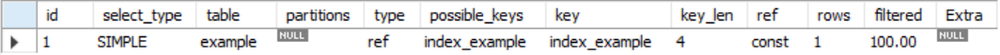
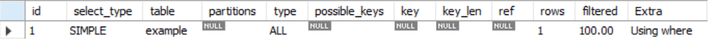

# 데이터 베이스 객체 작성과 삭제

## 데이터베이스 객체

테이블이나 뷰, 인덱스 등 데이터베이스 내에 정의하는 모든 것을 일컫는다. 데이터 베이스 객체는 스키마라는 그릇 안에 만들어진다. 그렇기에 객체의 이름이 같아도 스키마가 서로 다르다면 상관없다.

## 테이블 작성, 삭제, 변경

```sql
CREATE TABLE 테이블명 (열 정의1, 열 정의2...)
DROP TABLE 테이블명
ALTER TABLE 테이블명 하부명령
```

## CREATE TABLE로 테이블 작성하기

```sql
CREATE TABLE sample(
	no INTEGER NOT NULL,
	a VARCHAR(30),
	b DATE);
```

## 테이블 삭제하기

```sql
DROP TABLE 테이블 명;
DELETE FROM 테이블 명 WHERE;
TRUNCATE TABLE 테이블 명;
```

DELETE는 데이터를 삭제하더라도 데이터가 담겨있던 Storage는 없어지지 않고 commit 명령어를 사용하기 전이라면 rollback으로 복구가능하다. 하지만 그에 반해 TRUNCATE는 자동 commit이 되기 때문에 지운 데이터를 복구할 수 없다.

## 테이블 변경

```sql
ALTER TABLE 테이블명 변경 명령
```

- 열 추가, 삭제, 변경
- 제약 추가, 삭제

### 1. 열 추가

```sql
ALTER TABLE 테이블명 ADD 열 정의
ALTER TABLE sample ADD name NOT NULL;
```

### 2. 열 속성 변경

```sql
ALTER TABLE 테이블명 MODIFY 열이름 열정의
ALTER TABLE sample MODIFY name VARCHAR(5);
```

### 3. 열 이름 변경

```sql
ALTER TABLE 테이블명 CHANGE [기존 열 이름] [신규 열 정의]
ALTER TABLE sample CHANGE name username;
```

### 4. 열 삭제

```sql
ALTER TABLE 테이블명 DROP 열명
ALTER TABLE sample DROP name;
```

## 제약

### 1. 테이블 작성시 제약 정의

열에 대해 정의하는 제약 → 열 제약

```sql
CREATE TABLE sample (
	a INTEGER NOT NULL,
	b INTEGER NOT NULL UNIQUE,
	c VARCHAR(30)
);
```

한 개의 제약으로 복수의 열에 제약을 설명하는 경우 → 테이블 제약

```sql
CREATE TABLE sample (
	no INTEGER NOT NULL,
	sub_no INTEGER NOT NULL,
	name VARCHAR(20),
	PRIMARY KEY (no, sub_no)
);
```

제약에는 이름을 붙일 수 있다. 제약에 이름을 붙이면 추후에 관리하기가 쉬워진다.

```sql
CREATE TABLE sample (
	no INTEGER NOT NULL,
	sub_no INTEGER NOT NULL,
	name VARCHAR(20),
	CONSTRAINT pkey_sample PRIMARY KEY (no, sub_no)
);
```

### 2. 제약 추가

열 제약을 추가하는 경우

```sql
ALTER TABLE sample MODIFY name VARCHAR(20) NOT NULL;
```

테이블에 제약을 추가하는 경우

```sql
ALTER TABLE sample ADD CONSTRAINT pkey_sample PRIMARY KEY (no, no_sub);
```

### 3. 제약 삭제

열 제약 삭제하기

```sql
ALTER TABLE sample MODIFY name VARCHAR(30);
```

테이블 제약 삭제하기

```sql
ALTER TABLE sample DROP CONSTRAINT pkey_sample;
```

### 4. 기본키

```sql
CREATE TABLE sample (
	p INTEGER NOT NULL,
	a VARCHAR(30),
	CONSTRAINT pkey_sample PRIMARY KEY(p)
)
```

## 인덱스 구조

### 1. 인덱스

인덱스는 테이블에 불여진 색인이다. 인덱스의 역할은 검색 속도의 향상이다. 여기서 검색이란 SELECT 명령에 WHERE 구로 조건을 지정하고 그에 일치하는 행을 찾는 일련의 과정이다.

인덱스만으로는 아무 의미 없다. 목차 밖에 없는 책은 본 적이 없는 것처럼, 인덱스는 테이블에 의존하는 객체이다. 대부분의 데이터베이스에서 테이블을 삭제하면 인덱스도 같이 삭제된다.

인덱스를 사용하면 INSERT 명령을 하는 경우 인덱스를 최신 상태로 갱신하는 처리가 늘어나므로 처리속도가 떨어진다.

### 2. 검색에 사용하는 알고리즘(이진 트리, 해쉬)

- 풀 테이블 스캔

인덱스가 지정되지 않은 테이블을 검색 할 때는 풀 테이블 스캔이라는 불리는 검색 방법을 사용한다. 테이블에 저장된 모든 값을 처음부터 차례로 조사해나가는 것이다.

- 이진 탐색

집합을 반으로 나누어 조사하는 검색방법, 데이터가 항상 정렬된 상태로 있어야함.

- 이진 트리

집합 내에 중복하는 값을 가질 수 없다.

## 인덱스 작성과 삭제

### 1. 인덱스 작성

```sql
CREATE INDEX 인덱스명 ON 테이블명 (열명1, 열명2 ...)
CREATE INDEX index_sample ON sample(no);
```

SQL SERVER, MySQL 에서 인덱스는 테이블 내의 객체가 된다. 그렇기에 테이블 내에 이름이 중복되지 않도록 지정해 관리한다.

### 2. 인덱스 삭제

```sql
DROP INDEX 인덱스명
DROP INDEX 인덱스명 ON 테이블명
```

### 3. EXPLAIN

인덱스 작성을 통해 쿼리의 성능 향상을 기대할 수 있다. 이때 실제로 인덱스를 사용해 검색하는지 확인하기 위헤 EXPLAIN을 사용한다.

```sql
EXPLAIN SQL명령
CREATE INDEX index_example ON example (member_id);
EXPLAIN SELECT * FROM example WHERE member_id =1;
```



possible_keys → 사용될 수 있는 인덱스가 표시됨

key → 실제로 사용한 인덱스 표시

```sql
CREATE INDEX index_example ON example (member_id);
EXPLAIN SELECT * FROM example WHERE name = '1';
```



## 뷰 작성과 삭제

### 1. 뷰

데이터 베이스 객체란 테이블이나 인덱스 등 데이터베이스 안에 정의하는 모든 것을 말한다. 뷰 역시 데이터 베이스 객체 중 하나이다.

SELECT 명령은 객체가 아니다. 그렇기에 SELECT 명령에 이름을 지정할 수 없고 데이터베이스에 등록되지도 않는다. 이 처럼 데이터 베이스 객체로 등록 할 수 없는 SELECT 명령을 객체로서 이름을 붙여 관리할 수 있도록 한 것이 뷰이다.

⭐ 뷰는 SELECT 명령을 기록하는 데이터베이스 객체이다.

- 가상 테이블

뷰는 테이블처럼 취급할 수 있지만 ‘실체가 존재하지 않는다’ 라는 의미로 ‘가상 테이블’이라고 불린다. SELECT 명령으로 이루어지는 뷰는 테이블처럼 데이터를 쓰거나 지울 수 있는 저장공간을 가지지 않는다.

### 2. 뷰 작성과 삭제

뷰 작성

```sql
CREATE VIEW 뷰명 AS SELECT 명령
CREATE VIEW sample1 AS SELECT * from sample;
CREATE VIEW 뷰명(열명 1, 열명 2..) AS SELECT 명령
CREATE VIEW sample1(a,b,c) AS SELECT a1,b1,c1 FROM sample;
```

뷰 삭제

```sql
DROP VIEW 뷰명
DROP VIEW sample1;
```

### 3. 뷰의 약점

뷰는 데이터베이스 객체로서 저장장치에 저장된다. 하지만 테이블과 다르게 큰 저장 공간이 필요하지 않다. 데이터베이스에 저장되는 것을 SELECT 명령이기 때문이다. 그렇기에 저장 공간을 소비하지 않는 대신에 CPU 자원을 사용한다.