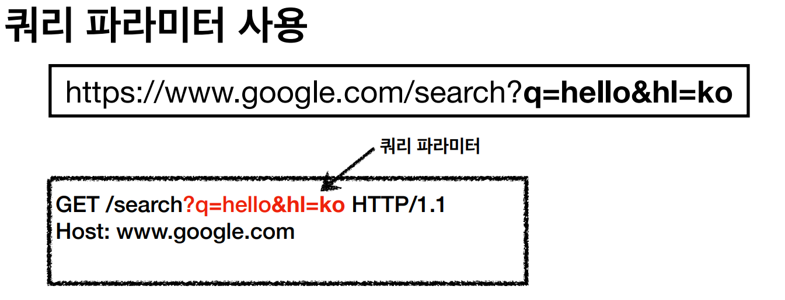
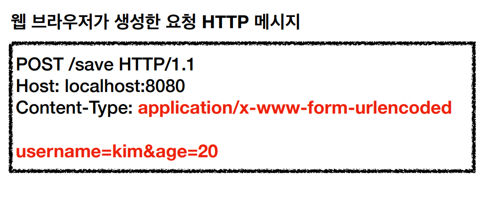
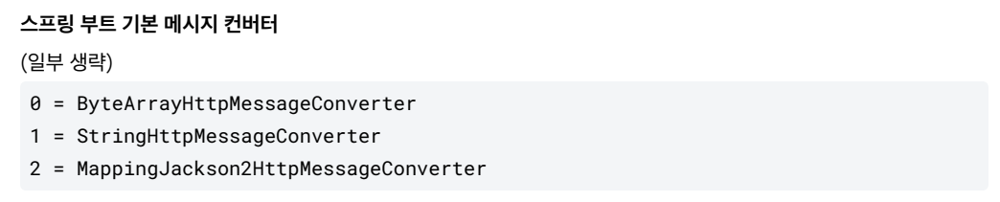
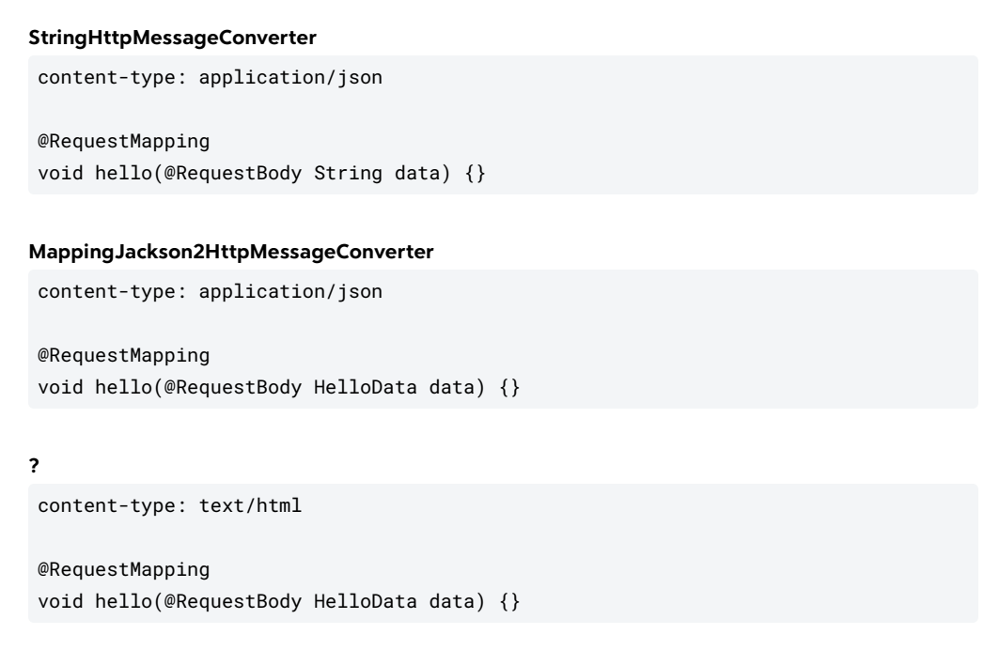
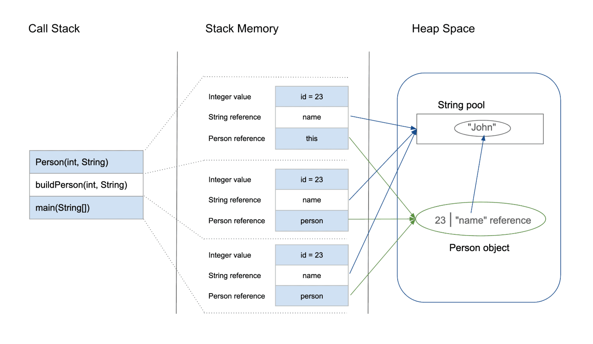

# 스프링 기능

1. 정적 데이터 조회
    1. 이미지, 정적 텍스트 문서
    2. 정적 페이지는 static 폴더에서 찾는다.
    3. 기본 / 페이지는 index.html을 찾는데 static, template 순서로 찾는다.
2. 동적 데이터 조회
    1. 주로 검색, 게시판 목록에서 정렬 필터
    2. templates 폴더에서 찾는다.
3. HTML Form을 통한 데이터 전송
    1. 회원 가입, 상품 주문, 데이터 변경
4. HTTP API를 통한 데이터 전송
    1. 회원 가입, 상품 주문, 데이터 변경

# 컨트롤러 대략적인 실행 순서(@RequestBody 예시)

1. 클라이언트는 특정 URL에 대해 요청을 한다.
2. 컨트롤러에서 특정 URL에 매핑되는 메서드를 찾는다.

```java
    @PostMapping("/reservations")
    public ReservationResponse addReservation(@RequestBody ReservationRequest request) {
        Long id = repository.add(request.dtoToReservationWithoutId());
        return ReservationResponse.from(repository.findById(id));
    }
```

1. 각 파라미터에 맞는 ArugmentResolver를 찾는다.

```java
// 인터페이스
public interface HandlerMethodArgumentResolver {
		// 지원하는가?
    boolean supportsParameter(MethodParameter parameter);
		// 파라미터 객체를 생성
    @Nullable
    Object resolveArgument(MethodParameter parameter, @Nullable ModelAndViewContainer mavContainer, NativeWebRequest webRequest, @Nullable WebDataBinderFactory binderFactory) throws Exception;
}

// 구현체 예시
public class RequestResponseBodyMethodProcessor extends AbstractMessageConverterMethodProcessor {
// ...
    @Nullable
    public Object resolveArgument(MethodParameter parameter, @Nullable ModelAndViewContainer mavContainer, NativeWebRequest webRequest, @Nullable WebDataBinderFactory binderFactory) throws Exception {
        parameter = parameter.nestedIfOptional();
        Object arg = this.readWithMessageConverters(webRequest, parameter, parameter.getNestedGenericParameterType());
        if (binderFactory != null) {
            String name = Conventions.getVariableNameForParameter(parameter);
            ResolvableType type = ResolvableType.forMethodParameter(parameter);
            WebDataBinder binder = binderFactory.createBinder(webRequest, arg, name, type);
            if (arg != null) {
                this.validateIfApplicable(binder, parameter);
                if (binder.getBindingResult().hasErrors() && this.isBindExceptionRequired(binder, parameter)) {
                    throw new MethodArgumentNotValidException(parameter, binder.getBindingResult());
                }
            }

            if (mavContainer != null) {
                mavContainer.addAttribute(BindingResult.MODEL_KEY_PREFIX + name, binder.getBindingResult());
            }
        }

        return this.adaptArgumentIfNecessary(arg, parameter);
    }

    @Nullable
    protected Object readWithMessageConverters(NativeWebRequest webRequest, MethodParameter parameter, Type paramType) throws IOException, HttpMediaTypeNotSupportedException, HttpMessageNotReadableException {
        ServletServerHttpRequest inputMessage = this.createInputMessage(webRequest);
        Object arg = this.readWithMessageConverters(inputMessage, parameter, paramType);
        if (arg == null && this.checkRequired(parameter)) {
            throw new HttpMessageNotReadableException("Required request body is missing: " + parameter.getExecutable().toGenericString(), inputMessage);
        } else {
            return arg;
        }
    }
}

```

# HTTP 요청 - 기본, 헤더 조회

https://docs.spring.io/spring-framework/reference/web/webmvc/mvc-controller/ann-methods/arguments.html

- HttpServletRequest
- HttpServletResponse
- HttpMethod : Http 메서드 조회
- Locale : Locale 정보를 조회
- @RequestHeader(”host”) String host
    - 특정 HTTP 헤더를 조회
- @CookieValue(value = “myCookie”, required = false ) String cookie

# HTTP 요청 파라미터 -  쿼리 파라미터, HTML Form

클라이언트에서 서버로 요청 데이터를 전달할 때는 주로 3가지 방법으로 한다.

- 1번) GET - 쿼리 파라미터(/url?username=hello&age=20)
    - 메시지 바디 없이, URL의 쿼리 파라미터에 데이터를 포함해서 전달

  

- 2번) POST - HTML Form
    - content-type : application/x-www-form-urlencoded
    - 메시지 바디에 쿼리 파라미터 형식으로 전달 username=hello&age=20

  

- 3번) HTTP message body에 데이터를 직접 담아서 요청
    - HTTP API에서 주로 사용, JSON,XML,TEXT

## 종류

### RequestParam → 1번과 2번에 사용가능

### ModelAttribute → 1번과 2번에 사용가능

- 기본 생성자를 찾고 setter 프로퍼티를 찾음(생성자가 많으면 기본 생성자가 우선)
- 요청과 맞는 생성자가 존재하고 그 생성자가 유일하면 생성자를 통해 생성(만약 가능한 생성자가 여러개 이면 실패)

### RequestBody → 3번에 사용

- HttpMessageConverter 사용

    ```sql
    public interface HttpMessageConverter<T> {
        boolean canRead(Class<?> clazz, @Nullable MediaType mediaType);
    
        boolean canWrite(Class<?> clazz, @Nullable MediaType mediaType);
    
        List<MediaType> getSupportedMediaTypes();
    
        default List<MediaType> getSupportedMediaTypes(Class<?> clazz) {
            return !this.canRead(clazz, (MediaType)null) && !this.canWrite(clazz, (MediaType)null) ? Collections.emptyList() : this.getSupportedMediaTypes();
        }
    
        T read(Class<? extends T> clazz, HttpInputMessage inputMessage) throws IOException, HttpMessageNotReadableException;
    
        void write(T t, @Nullable MediaType contentType, HttpOutputMessage outputMessage) throws IOException, HttpMessageNotWritableException;
    }
    ```

    - 일반 텍스트인 경우 → StringHttpMessageConverter 적용
    - JSON인 경우 → MappingJackson2HttpMessageConverter 적용
- JSON 인 경우 Jackson 라이브러리인 objectMapper 사용
    - 기본 생성자와 setter
    - 기본 생성자 → 자바 reflection 사용
    - 전체 생성자
    - 일부 생성자 → @JsonProperty가 있는 경우만 가능
    - 결론 그냥 기본 생성자 넣자 → 너무 복잡함…
- 스프링은 @RequestBody @ResponseBody 사용시 HTTP 메시지 컨버터를 적용

### ResponseBody

- getter가 있는거만 출력, 모두 없으면 406에러

# 🤔 메시지 컨버터



- ByteArrayHttpMessageConverter : byte[] 데이터를 처리한다.
- 클래스 타입: byte[] , 미디어타입:  */* ,
- 요청 예) @RequestBody byte[] data
- 응답 예) @ResponseBody return byte[] 쓰기 미디어타입 application/octet
- StringHttpMessageConverter : String 문자로 데이터를 처리한다.
- 클래스 타입: String , 미디어타입: */*
- 요청 예) @RequestBody String data
- 응답 예) @ResponseBody return "ok" 쓰기 미디어타입 text/plain
- MappingJackson2HttpMessageConverter : application/json
- 클래스 타입: 객체 또는 HashMap ,  미디어타입 application/json 관련
- 요청 예) @RequestBody HelloData data
- 응답 예) @ResponseBody return helloData 쓰기 미디어타입 application/json 관련



# 직렬화의 필요성

## 자바에서 스택과 힙

**Java의 스택 메모리는 정적 메모리 할당 및 스레드 실행에 사용됩니다. 스택** 메모리에는 메서드에 고유한 기본 값과 메서드에서 참조되는 힙에 있는 객체에 대한 참조가 포함됩니다.

**힙 공간은 런타임 시 Java 객체와 JRE 클래스의 동적 메모리 할당에 사용됩니다** . 새로운 객체는 항상 힙 공간에 생성되고, 이러한 객체에 대한 참조는 스택 메모리에 저장됩니다.



```java
Person p = new Person("코기", 24);
outputStream.writeObject(p); // 직렬화 O
socket.getOutputStream().write(p); // 직렬화 X
```