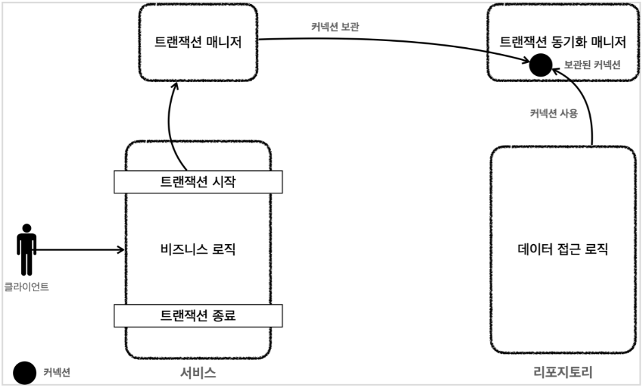

# ⭐ JDBCTemplate

스프링은 데이터베이스와의 연동을 쉽게 도와주는 여러 가지 도구와 방식을 제공한다. JDBC(Java Database Connectivity)는 자바에서 데이터베이스에 접속할 수 있게 도와주는 API이다. JdbcTemplate은 이러한 JDBC를 좀 더 편리하게 사용할 수 있도록 스프링에서 제공하는 템플릿 클래스이다. 이를 사용하면 데이터베이스 연동 코드를 좀 더 간결하고 안정적으로 작성할 수 있다. JdbcTemplate은 스프링 JDBC의 핵심이며 다른 고수준의 기능들도 결국 내부에서는 이 JdbcTemplate을 활용한다.

jdbcTemplate은 핵심 JDBC 작업 흐름(예: 문장 생성 및 실행)의 기본적인 업무를 수행하며, 애플리케이션 코드는 SQL을 제공하고 결과를 추출하는 역할을 담당한다. JdbcTemplate 클래스는 다음과 같은 기능을 제공한다.

- SQL 쿼리 실행
- statements 및 저장된 procedure all 업데이트
- ResultSet 인스턴스를 반복하고 반환된 매개 변수 값의 추출을 수행
- JDBC 예외를 캡처하여 org.springframework.dao 패키지에 정의된 일반적이고 더 유용한 예외 계층으로 변환

# JDBCTemplate은 왜 쓰는가?

## 1. 반복되는 자원 관리 코드 생략

```java
    private void savePiecesInfo(Map<Position, Piece> alivePieces, Connection connection) {
        String sql = "insert into board(row_index, column_index, piece_type, team) values (?,?,?,?)";
        for (Entry<Position, Piece> positionPieceEntry : alivePieces.entrySet()) {
            try (PreparedStatement preparedStatement = connection.prepareStatement(sql)) {
                Position position = positionPieceEntry.getKey();
                Piece piece = positionPieceEntry.getValue();
                preparedStatement.setInt(1, position.getRow());
                preparedStatement.setInt(2, position.getColumn());
                preparedStatement.setString(3, piece.getType().name());
                preparedStatement.setString(4, piece.getTeamType().name());
                preparedStatement.executeUpdate();
            } catch (SQLException e) {
                throw new RuntimeException(e);
            }
        }
    }
```

이전 jdbc를 사용을 했을 때 코드이다.  항상 Connection, preparedStatement, ResultSet 등 개발자가 관리해야한다. 그래서 대부분 메서드에서 동일한 코드가 나왔다. 매번 쓰기 귀찮았다. 이를 jdbcTemplate 안에서 관리해준다.

## 2. 스프링 표준 예외로 변경

jdbc는 SQLExcetion을 던진다. 현재는 try-catch로 예외를 잡아 언체크 예외로 변환하고 있지만 원래는 다음과 같이 메서드에 체크 예외 정보가 포함된다.

```java
public void savePiecesInfo() throws SQLException {}
```

이 부분은 문제가 된다. 만약 이를 인터페이스로 만드려면 다음과 같이 작성해야한다.

```java
public void savePiecesInfo() throws SQLException;
```

인터페이스는 확장있는 설계를 위해 도입된다. 하지만 현재는 jdbc를 사용하지만 만약 jpa 기술로 바뀐다면 어떻게 될까? 그때 던지는 예외는 SQLException이 아니라 다른 예외를 던지게된다. 그렇기에 해당 인터페이스를 사용하지 못한다. 이를 위해서 스프링은 표준 예외를 지정하고 언체크 예외로 자동으로 변경해준다.

```java
    @Override
    public ReservationTime findById(Long id) {
        return jdbcTemplate.queryForObject("select * from reservation_time where id = ?", reservationTimeRowMapper(),
                id);
    }
```

다음에서 해당 id가 찾지 못하는 경우 언체크 예외로 스프링 표준 예외인  EmptyResultDataAccessException를 던진다.

## 3. 트랜잭션

트랜잭션 시작은 보통 서비스 층에서 시작한다. 같은 트랜잭션을 위해 레포지토리는 같은 커넥션을 사용해야한다.

```java
    public void save(Board board) {
        Map<Position, Piece> alivePieces = board.getAlivePieces();
        try (Connection connection = getConnection()) {
            savePiecesInfo(alivePieces, connection);
        } catch (SQLException e) {
            throw new RuntimeException(e);
        }
    }
```

이전 장기 미션에서는 dao에서 커넥션을 생성하고 관리하였다. 이제는 서비스 계층에서 생성하고 관리해야한다. 즉 서비스에서 커넥션을 생성하고 다음과 같이 인자로 Connection을 받고 사용해야한다. 또한 이 Connection을 닫으면 안된다.

```java
    // 레포지토리 계층
    public void save(Board board, Connection connection) {
        Map<Position, Piece> alivePieces = board.getAlivePieces();
        savePiecesInfo(alivePieces, connection);
    }
    
    // 서비스 계층
    public void save() {
	    Connection con = getConnection();
	    con.setAutoCommit(false);
	    ...
	    save(board,con);
	    con.commit();
	    con.setAutoCommit(true);
	    con.close();
	  }
```

Connection은 jdbc 기술이다. 이를 서비스에서 가지고 있는 것도 jdbc에 의존적인 코드가 되어 버린다. 이를 해결하기 위해 트랜잭션 메니저라는 추상화를 사용한다. 트랜잭션 메니저를 통해 트랜잭션을 관리한다.

```java
public interface TxManager { // 스프링의 트랜잭션 추상화
	begin();
	commit();
	rollback();
}

// 서비스 계층
public void save() {
	 txManager.begin();
	 ...
	 save(board,con);
	 txManager.commit();
}

// 레포지토리 계층
    public void save(Board board) {
		    Connection connection = DataSourceUtils.getConnection(dataSource);
        Map<Position, Piece> alivePieces = board.getAlivePieces();
        savePiecesInfo(alivePieces, connection);
    }

```



이렇게 트랜잭션을 관리할 수 있고 레포지토리에서는 트랜잭션 동기화 메니저에 있는 커넥션을 가져다 쓴다. 이런 코드가 레포지토리에 항상 존재해야하는데 jdbcTemplate은 이를 생략하게 해준다.

# JDBCTemplate 기능

## JDBC 배치 작업

대부분의 JDBC 드라이버는 동일한 준비된 명령문에 대한 여러 호출을 일괄 처리하면 성능이 향상됩니다. 업데이트를 일괄 처리로 그룹화하면 데이터베이스 왕복 횟수를 줄일 수 있다.

```java
List<Object[]> splitUpNames = Arrays.asList("John Woo", "Jeff Dean", "Josh Bloch", "Josh Long")
            .stream()
            .map(name -> name.split(" "))
            .collect(Collectors.toList());

jdbcTemplate.batchUpdate("insert into customers(first_name, last_name) values (?,?)",splitUpNames);
```

## DDL

이 메서드를 사용하면 임의의 SQL을 실행할 수 있습니다 `execute(..)`. 따라서 이 메서드는 DDL 문에 자주 사용됩니다. 

```java
jdbcTemplate.execute("DROP TABLE customers IF EXISTS");
```

## Count 조회

```java
int count = jdbcTemplate.queryForObject("select count(*) from customers", Integer.class);
```

## 특정 조건에서 Object 조회

```java
String lastName = jdbcTemplate.queryForObect("select lastName from customers where id = ?",String.class,1L);
Customer customer = jdbcTemplate.queryForObject("select * from customers where id = ?",
																		(rs,rn) -> new Customer(
																									rs.getLong("id"),
																									rs.getString("last_name"),
																									rs.getString("first_name")),
																									1L);
List<Customer> customers = jdbcTemplate.query("select * from customers",
																		(rs,rn) -> new Customer(
																									rs.getLong("id"),
																									rs.getString("last_name"),
																									rs.getString("first_name"));											
```

## Insert/Update/Delete

```java
jdbcTemplate.update("insert into customers(first_name,last_name) values(?,?)",
								first_name,
								last_name);
int deleteCount = jdbcTemplate.update("delete from customers where id = ?", id);
```

## 자동 생성된 키 검색

```java
KeyHolder keyHolder = new GeneratedKeyHolder();

jdbcTemplate.update((connection) - > {
											PreparedStatement ps = connection.prepareStatement(
															"insert into customers(first_name,last_name) values(?,?)",
															new String[]{"id"});
											ps.setString(1,firstName);
											ps.setString(2,lastName);
											return ps;
										}, keyHolder);
Long id = keyHolder.getKey().longValue();
```

## RowMapper

`RowMapper`는 **Spring JDBC**에서 자주 사용하는 인터페이스로,

> ResultSet의 한 행(row)을 Java 객체로 변환할 때 사용된다.
>

```java
@FunctionalInterface
public interface RowMapper<T> {
    @Nullable
    T mapRow(ResultSet rs, int rowNum) throws SQLException;
}
```

# NamedParameterJdbcTemplate 기능

파라미터에 이름 지정 가능

```java
    @Override
	  public Reservation create(Reservation reservation) {
			  String sql = "insert into reservation(name, date, time_id) values (:name,:date,:time_id)"
        ReservationTime reservationTime = reservation.getReservationTime();
        String date = reservationDate.toString();
        Long timeId = reservationTime.getId();

        SqlParameterSource params = new MapSqlParameterSource()
                .addValue("name", name)
                .addValue("date", date)
                .addValue("time_id", timeId);

        return namedParamterJdbcTemplate.update(sql,params);
    }
```

# SimpleJdbcInsert

keyHolder 사용 귀찮음 해소

```java
    // jdbcTemplate
    @Override
	  public Reservation create(Reservation reservation) {
        ReservationTime reservationTime = reservation.getReservationTime();
        String date = reservationDate.toString();
        Long timeId = reservationTime.getId();

        KeyHolder keyHolder = new GeneratedKeyHolder();

        jdbcTemplate.update((connection) -> {
            PreparedStatement ps = connection.prepareStatement(
                    "insert into reservation(name, date, time_id) values (?,?,?)",
                    new String[]{"id"});
            ps.setString(1, name);
            ps.setString(2, date);
            ps.setLong(3, timeId);
            return ps;
        }, keyHolder);

        return reservation.assignId(keyHolder.getKey().longValue());
    }
    
    // SimpleJdbcInsert
    @Override
    public Reservation create(Reservation reservation) {
        String name = reservation.getName();
        LocalDate reservationDate = reservation.getReservationDate();
        ReservationTime reservationTime = reservation.getReservationTime();
        String date = reservationDate.toString();
        Long timeId = reservationTime.getId();
        
        SqlParameterSource params = new MapSqlParameterSource()
                .addValue("name", name)
                .addValue("date", date)
                .addValue("time_id", timeId);
                
        Long id = simpleJdbcInsert.executeAndReturnKey(params).longValue();

        return reservation.assignId(id);
    }
```

# ⭐Spring Context

# IoC와 DI

## IoC(Inversion of Control)

프로그래머가 코드의 흐름, 객체 생성 주기, 메서드 호출 등 전체적인 흐름을 담당하지 않고 외부에서 흐름을 담당하는 것이다.

Ioc 컨테이너는 객체 생성과 생명 주기를 담당해준다.

라이브러리는 개발자가 직접 호출해서 적절한 사용시기 때 개발자가 직접 사용한다. 즉, 개발자가 코드의 흐름을 담당한다.

## DI(Dependcy Injection)

필요한 의존성을 내가 직접 생성하는 것이 아니라 외부에서 주입을 받겠다. 스프링에서는 IoC 컨테이너가 역할을 담당함

객체는 구체 클래스에 의존하지 않고 인터페이스에 의존을 한다. 이때 실제 구현 클래스는 외부에서 주입을 한다. 컴파일 시점에서는 어떤 구현 클래스가 들어올지 모르고 런타임이 되어야 외부에서 주입을 받아 실제 객체 의존 관계를 알 수 있다.

# Application Context

ApplicationContext는 스프링의 Bean의 설정 정보와 라이프사이클을 관리하는 스프링의 인터페이스이다.

```java
   // taticApplicationContext를 사용하여 코드 상에서 직접 Bean을 등록하고 관리합니다.
    @Test
    void sprintContextTest(){
        // IOC 컨테이너 생성
        StaticApplicationContext context = new StaticApplicationContext();
        // Hello 클래스를 싱글톤 빈으로 컨테이너에 등록
        context.registerSingleton("hello", Hello.class);

        Hello hello = context.getBean("hello",Hello.class);
        Hello hello1 = context.getBean("hello", Hello.class);
        Assertions.assertThat(hello).isEqualTo(hello1);
    }
```

# Bean Definition

Bean Definition은 Bean의 메타 정보를 담는 오브젝트이다.

Bean의 생성 방법, 생성 시 주입할 값 및 프로퍼티, 라이프사이클 설정 등 다양한 정보를 포함하고 있다.

# 왜? 싱글톤으로 관리하는가?

원래 초기 스프링은 웹 애플리케이션을 위한 프레임워크였다.

고객 요청이 올때마다 객체를 생성? 너무 비효율적, 메모리 낭비가 심하다.

### 싱글톤의 단점

- 싱글톤 패턴을 구현하는 코드 자체가 많이 들어간다.
- 테스트하기 어렵다.
- 클라이언트가 구체 클래스에 의존한다. → DIP 위반
- 내부 속성을 변경하거나 초기화하기 어렵다.

### 💡 Configuration 애노테이션 → 싱글톤으로 관리되도록 도와줌

```java
@Configuration
public class AppConfig {

    @Bea
    public AuthService authService() {
        System.out.println("authService 호출");
        return new AuthService();
    }

    @Bean
    public AuthenticationPrincipalArgumentResolver authenticationPrincipalArgumentResolver() {
        System.out.println("authenticationPrincipalArgumentResolver 호출");
        return new AuthenticationPrincipalArgumentResolver(authService());
    }

}
```

# 주입 방법

- 생성자 주입 → 생성자 주입을 사용하자!
    - 불변 유지 가능
    - 유연한 테스트 가능
- setter 주입
    - 컴파일 오류를 잡을 수가 없다. → 생성자에서 필드 값을 만들지 않고 setter에 의존한 경우 nullPointerException 발생 가능
    - 개발자가 setter를 사용하여 필드를 변경하기에 예상치 못한 오류가 발생할 수 있다.
- 필드 주입
    - 스프링 의존적 테스트만 가능하다.
    - 단위 테스트는 불가능하다.

# PropertySource

환경에 대해 이미 등록된 속성 소스 집합에 대해 확인

`classpath:`는 **`src/main/resources` 디렉토리**를 기준으로 경로를 잡는

### `@Value` 단독 사용 (기본 프로퍼티 파일에서 읽을 때)

```java
@Value("${my.name}")
private String name;
```

➡️ 이건 `application.properties`나 `application.yml`에 있는 값을 바로 주입하는 거야.

하지만 이 키가 `my-custom.properties` 같은 **다른 파일에 있다면**, 에러 나.

---

### 2. `@PropertySource`를 함께 써야 하는 경우

```java
java
복사편집
@Configuration
@PropertySource("classpath:/custom/app.properties")
public class MyConfig {

    @Value("${my.name}")
    private String name;

}

```

➡️ 이럴 경우 `app.properties` 파일을 스프링 환경으로 로딩하고,

그 안의 값을 `@Value`로 가져오는 거야.

> 즉, @PropertySource 없으면 스프링이 app.properties를 모르기 때문에
>
>
> `@Value`로 값을 읽어올 수 없어.
>

## 그럼 Spring Boot에서는 언제 `@PropertySource`가 필요해?

- `application.properties` / `application.yml` 외의 **다른 프로퍼티 파일을 사용하고 싶을 때**
- 예를 들어 `aws.properties`, `db-config.properties` 같은 별도 설정 파일들을 쪼개고 싶을 때

# Profile

`@Profile` 어노테이션을 이용하여 특정 프로파일에 따라 빈을 등록할 수 있습니다. `@Profile` 어노테이션은 클래스 레벨, 메서드 레벨에 모두 적용 가능합니다.

Spring Boot는 프로퍼티 파일 컨벤션(`application-{profile}`)을 사용해 활성 프로파일에 대한 프로퍼티 파일을 로드합니다. 예를 들어, 활성 프로파일이 prod 라면 `application.properties`, `application-prod.properties` 파일을 로드합니다.