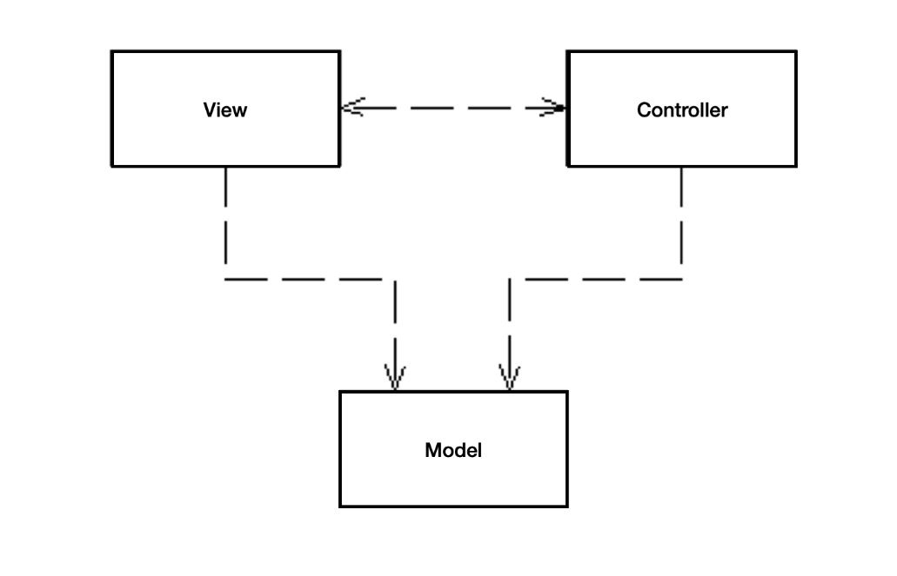
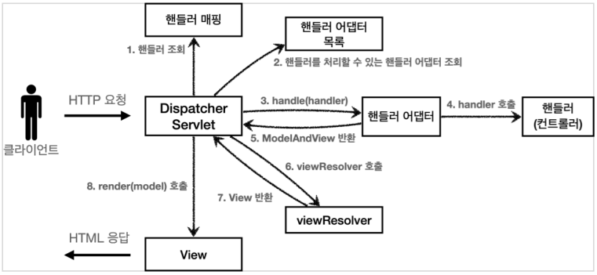
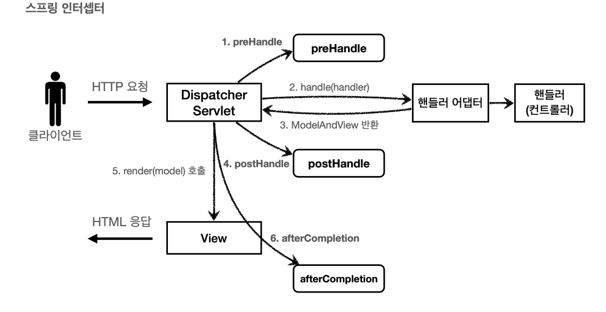
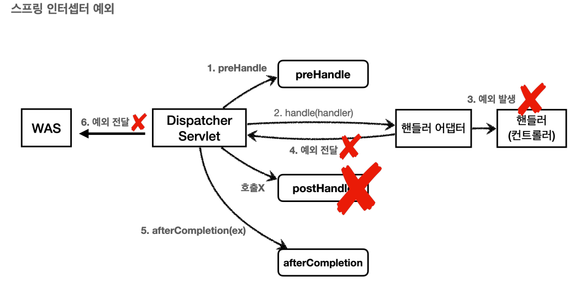

# ⭐ 스프링 MVC
- 컨트롤러 : HTTP 요청을 받아서 파라미터를 검증하고, 비즈니스 로직을 실행한다. 그리고 뷰에 전달할 결과 데이터를 조회해서 모델에 담는다.
- 모델 : 뷰에 출력할 데이터를 담아둔다. 뷰가 필요한 데이터를 모두 모델에 담아서 전달해주는 덕분에 뷰는 비즈니스 로직이나 데이터 접근을 몰라도 되고, 화면을 렌더링하는 일에 집중할 수 있다.
- 뷰 : 모델에 담겨있는 데이터를 사용해서 화면을 그리는 일에 집중한다. 여기서는 HTML을 생성하는 부분을 말한다.



# 스프링 MVC 구조



스프링 MVC는 프론트 컨트롤러 패턴을 사용하였음

1. 특정 URL에 대한 요청이 들어옴
2. 요청에 대한 URL, HTTP Method 정보 등으로 처리할 수 있는 핸들러(컨트롤러)를 찾음
3. Dispatcher Servlet은 핸들러에게 ModelAndView 라는 객체를 받아야함(ModelAndView → 뷰에 대한 정보와 뷰에게 넘길 Model에 대한 정보를 가지고 있는 객체)
4. 찾은 핸들러는 반환 값이 ModelAndView로 고정 되어 있지 않음. 그래서 스프링은 핸들러 어뎁터를 추상화하여 무조건 ModelAndView가 반환하도록 정해둠
5. 핸들러 어댑터 목록에서 찾은 핸들러를 다룰 수 있는 어댑터를 찾고 비즈니스 로직을 수행 후 ModelAndView를 반환함.
6. viewResolver에서 view를 처리할 수 있는 객체를 찾고 view로 변환함
7. dispatcher servlet은 렌더링을 함

# 페이지 컨트롤러 패턴

```java
@WebServlet(
  name = "StudentServlet", 
  urlPatterns = "/student-record")
public class StudentServlet extends HttpServlet {

    private StudentService studentService = new StudentService();

    private void processRequest(
      HttpServletRequest request, HttpServletResponse response) 
      throws ServletException, IOException {
				// 파라미터 추출
        String studentID = request.getParameter("id");
        if (studentID != null) {
            int id = Integer.parseInt(studentID);
            studentService.getStudent(id)
              .ifPresent(s -> request.setAttribute("studentRecord", s));
        }
				// 뷰 렌더링 코드
        RequestDispatcher dispatcher = request.getRequestDispatcher(
          "/WEB-INF/jsp/student-record.jsp");
        dispatcher.forward(request, response);
    }
}
```

- 요청 URL 마다 서블릿이나 컨트롤러 클래스가 1:1로 매핑됨
- 결국 모든 서블릿을 구현한 코드는 파라미터 추출, 뷰 렌더링 등이 중복으로 나타남
- 현재 JSP를 사용하고 있는데 타임리프로 바꾼다면 모든 서블릿 구현 코드의 뷰 렌더링 코드를 고쳐야함

# 프론트 컨트롤러 패턴

페이지 컨트롤러 패턴의 단점을 보완하자! 중복되는 부분은 하나의 컨트롤러가 처리를 하자!

```java

@WebServlet(name = "frontControllerServlet", urlPatterns = "/")
public class FrontControllerServlet extends HttpServlet {
		// 생략

    @Override
    protected void service(HttpServletRequest request, HttpServletResponse response) throws ServletException, IOException {
				// 처리할 수 있는 컨트롤러 찾기
        Object handler = getHandler(request);
        if (handler == null) {
            response.setStatus(HttpServletResponse.SC_NOT_FOUND);
            return;
        }
				// 찾은 컨트롤러의 결과 값을 반환하는 특정 어뎁터 찾기
        MyHandlerAdapter adapter = getHandlerAdapter(handler);
				// 어뎁터를 통해 찾은 컨트롤러를 실행하고 ModelView 객체 가져오기
        ModelView mv = adapter.handle(request, response, handler);

        String viewName = mv.getViewName();
        // ModelView 객체 안에 있는 view 정보를 통해 View 가져오기
        MyView view = viewResolver(viewName);
				// 뷰 렌더링
        view.render(mv.getModel(), request, response);

    }
    // 생략
}
```

```java
// 구식 컨트롤러 코드
@Component("/springmvc/old-controller")
public class OldController implements Controller {

    @Override
    public ModelAndView handleRequest(HttpServletRequest request, HttpServletResponse response) {
        System.out.println("OldController.handleRequest");
        return new ModelAndView("new-form");
    }
}

// 현재 컨트롤러 코드
@Controller
@RequestMapping("/admin")
public class AdminController {

    @GetMapping
    public String admin(Model model) {
		    model.addAttribute("data",data);
        return "admin/index";
    }
}
```

# View Controller

뷰가 응답을 생성하기 전에 실행할 Java 컨트롤러 로직이 없는 정적인 경우에 사용할 수 있다. 정적인 페이지를 바로 리턴하는 경우이다. 비즈니스 로직이 없는 경우 사용한다.

```java
@Configuration
public class WebMvcConfiguration implements WebMvcConfigurer {
    @Override
    public void addViewControllers(ViewControllerRegistry registry) {
        registry.addViewController("/").setViewName("hello");
    }resolvers.add(new AuthenticationPrincipalArgumentResolver());
    }
}
```

# ⭐ 인증과 인가
# 토큰 vs 세션

토큰과 세션의 큰 차이점은 로그인 인증 정보를 누가 가지고 있냐이다. 세션은 로그인 인증 정보를 서버에서 들고 있고 토큰은 클라이언트가 들고 있다.

## JWT의 단점

서버의 제어권이 없다. 토큰이 탈취 당했을때 서버가 할 수 있는게 없다.

그래서 토큰의 유효시간을 짧게 한다. 하지만 이런 경우 사용자가 재로그인을 해야한다.

그렇기에 리프래쉬 토큰을 발급하고 서버에서 저장을 한다. 리프래쉬 토큰은 1회만 사용하고 새롭게 발급한다. 이대 리프레쉬 토큰에 대한 정보를 서버에서 관리한다.

→ 이렇게 되면 세션이랑 무슨 차이가 있는가??

1. Storage 접근 횟수

세션의 경우 api 호출 마다 Storage에 접근한다. 하지만 jwt 토큰은 리프레쉬 토큰을 통해 재발급할 때만 접근한다.

2. Storage 가 죽으면?

세션은 바로 막히지만, jwt는 엑세스 토큰의 기한만큼 사용가능하다.

→ 그러면 세션은 언제 사용해?

보안이 매우 중요한 경우, 서버에서 직접 관리하기 때문

## 질문

어떤 앱은 로그아웃을 직접하지 않으면 평생 가던데 이건 어떻게 구현되어 있는거지..?

리프래쉬 토큰을 계속 재발급해주는건가..?


# ⭐ 필터와 인터셉터


# 1. 필터

HTTP 요청  → WAS → 필터 → 서블릿 → 컨트롤러

```java
public interface Filter {
    default void init(FilterConfig filterConfig) throws ServletException {
    }

    void doFilter(ServletRequest var1, ServletResponse var2, FilterChain var3) throws IOException, ServletException;

    default void destroy() {
    }
}
```

- 예시

    ```java
    public class LogFilter implements Filter {
        @Override
        public void doFilter(ServletRequest servletRequest, ServletResponse servletResponse, FilterChain filterChain)
                throws IOException, ServletException {
            System.out.println("log filter 적용");
            filterChain.doFilter(servletRequest, servletResponse);
            System.out.println("log filter 종료");
        }
    }
    ```

    - 등록

    ```java
    // Configuration으로 등록하기
    @Configuration
    public class WebConfig {
    
        @Bean
        public FilterRegistrationBean logFilter(){
            FilterRegistrationBean<Filter> filterFilterRegistrationBean = new FilterRegistrationBean<>();
            filterFilterRegistrationBean.setFilter(new LogFilter());
            filterFilterRegistrationBean.setOrder(1);
            filterFilterRegistrationBean.addUrlPatterns("/*");
            return filterFilterRegistrationBean;
        }
    }
    
    // 스캔으로 등록하기
    @SpringBootApplication
    @ServletComponentScan
    public class DemoApplication {
    
    	public static void main(String[] args) {
    		SpringApplication.run(DemoApplication.class, args);
    	}
    
    }
    
    @Component
    @WebFilter(urlPatterns = "/*")
    @Order(1)
    public class LogFilter implements Filter {
        @Override
        public void doFilter(ServletRequest servletRequest, ServletResponse servletResponse, FilterChain filterChain)
                throws IOException, ServletException {
            System.out.println("log filter 적용");
            filterChain.doFilter(servletRequest, servletResponse);
            System.out.println("log filter 종료");
        }
    }
    ```


서블릿 컨테이너와 스프링 컨테이너는 다름.

| 항목 | 서블릿 컨테이너 | 스프링 컨테이너 |
| --- | --- | --- |
| 역할 | HTTP 요청/응답 처리, 서블릿 실행 | 객체 생성, 의존성 주입, 생명주기 관리 |
| 예시 | Tomcat, Jetty | `ApplicationContext`, `BeanFactory` |
| 대상 | 서블릿, 필터, 리스너 등 | @Component, @Service, @Repository 등 |
| 초기화 시점 | 웹 애플리케이션 실행 시 (서버가 뜰 때) | Spring 애플리케이션 시작 시 |
| 라이프사이클 관리 | 서블릿/필터 등 웹 컴포넌트 | 빈(Bean) 객체 |
| 요청 처리 | URL 매핑, 서블릿 호출 | DispatcherServlet 등록 후 요청 전달받음 |

스프링은 위와 같이 Configuration으로 등록시 자동으로 서블릿 컨테이너에 등록되게함. 스프링 컨테이너에는 등록 안함.

# 1. 인터셉터

- 스프링 인터셉터에도 URL 패턴을 적용할 수 있는데, 서블릿 URL 패턴과는 다르고 더 정밀하게 설정이 가능하다.
- ServletRequest → HttpServletRequest 다운 캐스팅
- 컨트롤러 호출 전, 호출 후, 요청 완료 이후와 같이 세분화 되어 있다.

HTTP 요청  → WAS → 필터 → 서블릿 → 인터셉터 → 컨트롤러

```java
public interface HandlerInterceptor {
    default boolean preHandle(HttpServletRequest request, HttpServletResponse response, Object handler) throws Exception {
        return true;
    }

    default void postHandle(HttpServletRequest request, HttpServletResponse response, Object handler, @Nullable ModelAndView modelAndView) throws Exception {
    }

    default void afterCompletion(HttpServletRequest request, HttpServletResponse response, Object handler, @Nullable Exception ex) throws Exception {
    }
}
```





- preHandle : 컨트롤러 호출 전 즉, 핸들러 어댑터 호출 전에 호출된다.
    - 응답 값이 true이면 다음으로 진행하고, false이면 진행하지 않는다.
- postHandle : 컨트롤러 호출 후에 호출된다. 예외가 발생하면 호출되지 않는다.
- afterCompletion : 뷰가 렌더링 된 이후에 호출된다. 예외가 발생해도 호출된다.

```java
// 적용 예시
public class LogInterceptor implements HandlerInterceptor {
    @Override
    public boolean preHandle(HttpServletRequest request, HttpServletResponse response, Object handler)
            throws Exception {
        System.out.println("로그 호출");
        return true;
    }

    @Override
    public void afterCompletion(HttpServletRequest request, HttpServletResponse response, Object handler, Exception ex)
            throws Exception {
        System.out.println("로그 호출 종료");
        HandlerInterceptor.super.afterCompletion(request, response, handler, ex);
    }
}

// 등록
@Configuration
public class WebConfig implements WebMvcConfigurer {

    @Override
    public void addInterceptors(InterceptorRegistry registry) {
        registry.addInterceptor(new LogInterceptor())
                .order(1)
                .addPathPatterns("/**");
    }
}
```