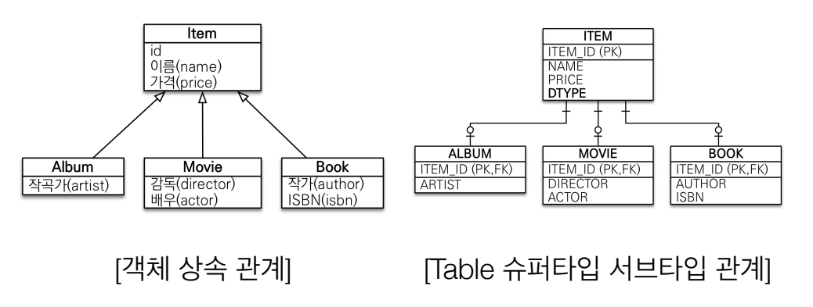
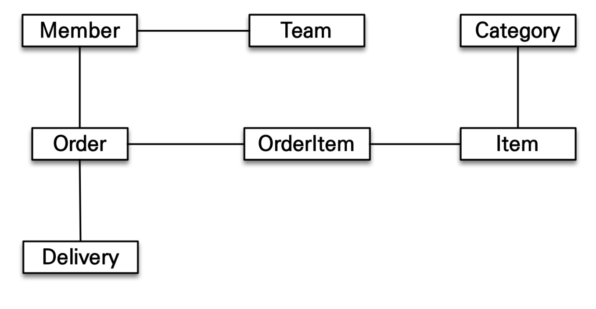
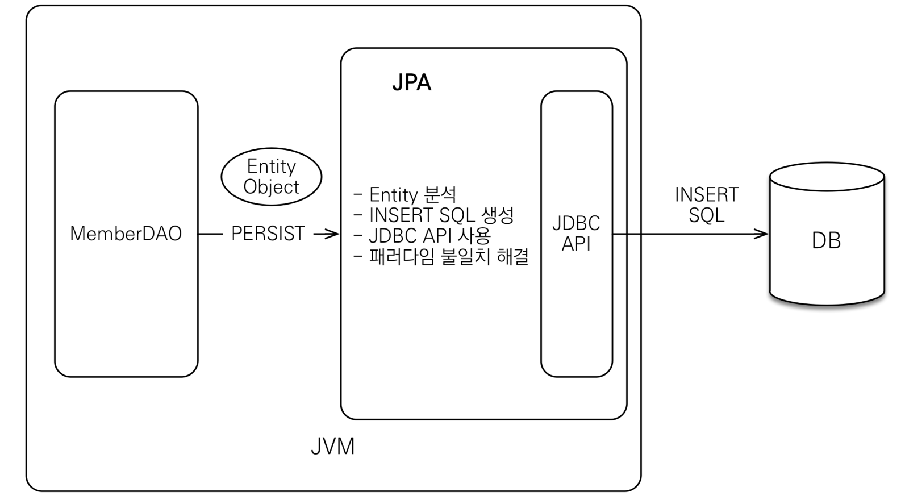
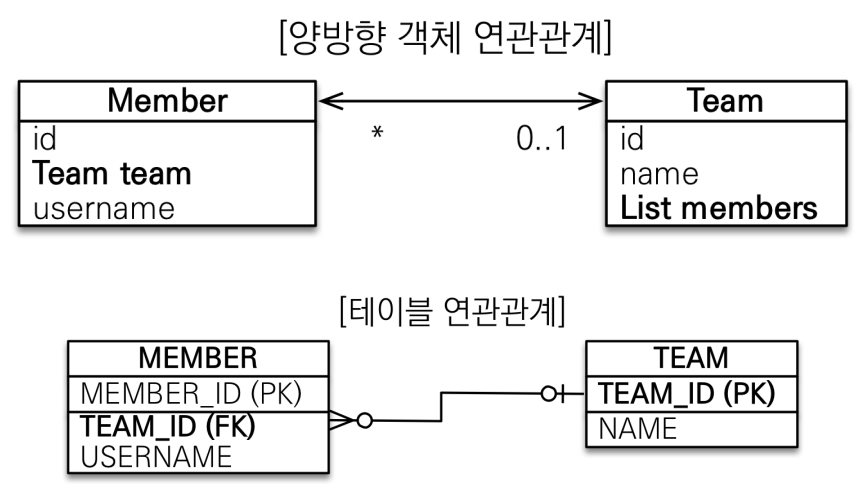
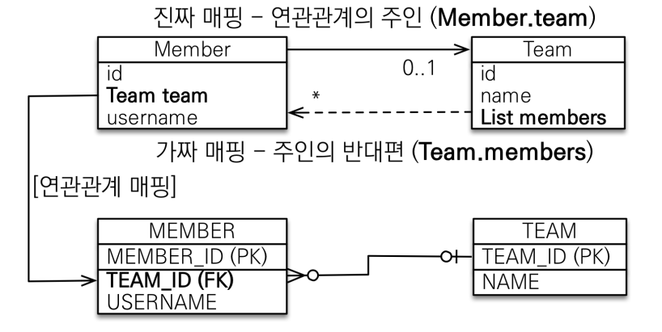

## ❌ SQL 중심적인 개발의 문제점

객체 → 관계형 DB에 저장하는 시대

그렇기 위해 수많은 SQL 을 사용해야함

- 무한 반복되고 하기 귀찮음
    - 객체에 필드를 추가하는 경우 → 객체 뿐만 아니라 DAO도 수정해야함
- 패러다임의 불일치
    - 객체와 관계형 데이터베이스의 차이

      ### 1. 상속

      

      객체에는 상속 관계가 있지만 데이터베이스에는 없음. 유사하게 작동하도록 테이블을 따로 만들어서 관리함

      만약 Album을 저장한다고 하면 다음과 같이 쿼리문을 날려야한다.

        1. 객체 분해
        2. INSERT INTO ITEM …
        3. INSERT INTO ALBUM …

      만약 Album을 가져와야한다면 다음과 같은 순서가 필요

        1. 각각 테이블에 조인 SQL 작성
        2. 각각의 객체 생성

      ⭐ 이와 다르게 자바에서는 상속을 사용하여 컬렉션에서 조회하게 되면 단순히 컬렉션에 저장만 하면된다.

        ```java
        List<Item> items = new ArrayList();
        items.add(album);
        // 부모 타입으로 조회 후 다형성 활용
        	Item item = list.get(albumId);
        ```

      ### 2. 연관관계

        - 객체는 참조를 사용 : member.getTeam()
        - 테이블은 외래 키 사용 : JOIN ON M.TEAM_ID = T.TEAM_ID

        ```java
        // 테이블레 맞춘 객체 저장
        class Member { // -> insert into member(member_id, team_id, username) values ...
        	String id;
        	Long teamId;
        	String username;
        }
        // 객체 다운 모델링
        class Member {
        	 String id;
        	 Team team;
        	 String username;
        	 
        	 Team getTeam() {
        		 return team;
        		}
        }
        
        class Team {
        	Long id;
        	String name;
        }
        ```

      객체 모델링 조회시 모든 조인 쿼리를 통해서 객체를 생성해야함 → 만약 객체 의존성이 깊다면..? 모든 걸 조인해서 가져와야한다.

      ⇒ 결국 엔티티 신뢰 문제가 발생한다. 내부 객체가 있는지 믿을 수 가 없다. 결국 find 라는 함수를 찾아서 모두 조인이 되어 있나 확인해야한다.

        ```java
        class MemberSerivce {
        	public void process() {
        		Member member = memberDao.find(memberId);
        		member.getTeam(); // ??? 널인가??? 아닌가???
        		member.getOrder(); // ??
        	}
        }
        ```

      

      ⭐ 이와 다르게 자바 컬렉션에 관리한다면

        ```java
        list.add(member);
        Member member = list.get(memberId);
        Team team = member.getTeam();
        ```

      ### 3. 비교하기

        ```java
        Long memberId = 1L;
        Member member1 = memberDao.getMember(memberId);
        Member member2 = memberDao.getMember(memberId);
        member1 == member2; // 다르다 -> 물론 equals 메서드로 구현할 수 있지만 귀찮음
        ```

      ⭐ 이와 다르게 자바 컬렉션에서 조회한다면

        ```java
        Long memberId = 1L;
        Member member1 = list.getMember(memberId);
        Member member2 = list.getMember(memberId);
        member1 == member2; // 같음
        ```


## ⭐ ORM

- Object-relational mapping(객체 관계 매핑)
- 객체는 객체대로 설계
- 관계형 데이터베이스는 관계형 데이터베이스대로 설계
- ORM 프레임워크가 중간에서 매핑



- 생산성 → 데이터베이스를 마치 자바의 컬렉션을 사용하듯이 사용한다.
    - 저장 : em.persist(member) === list.add(member)
    - 조회 : Member member = em.find(Member.class,memberId_ === list.get(memberId)
    - 수정 : member.setName(”이름”)
    - 삭제 : em.remove(member) === list.remove(member)
- JPA와 패러다임의 불일치 해결


## ⭐ 양방향 연관관계와 연관관계 주인



### 🤔 객체와 테이블이 관계를 맺는 차이

- 객체 연관관계 = 2개
    - 회원 → 팀 연관관계 1개(단방향)
    - 팀 → 회원 연관관계 1개(단방향)

  실질적으로 객체에서 양방향이라는 관계는 없음, 단뱡향 2개를 양방향이라고 지칭

  객체의 양방향 관계는 사실 양방향 관계가 아니라 서로 다른 단방향 관계 2개이다.

- 테이블 연관관계 = 1개
    - 회원 ↔ 팀의 연관관계 1개(양방향)

### ❌ 문제점

JPA는 다음과 같은 혼란이 있을 수 있다.

- Member의 team 값을 바꿨을 때 외래 키의 값을 업데이트 해야하는가?
- Team 안에 있는 members에 Member를 추가했을 때 외래 키 값을 업데이트 해야하는가?

예) Member의 Team에는 A라는 팀이 있고, A라는 팀 객체의 members에는 해당 Member 객체를 추가하지 않았다면??

그렇기에 객체 둘 중 하나로 외래 키를 관리해야한다.

### ⭐ 연관관계의 주인

양방향 연관관계일 때 어떤 객체가 수정되었을 때 외래 키를 수정할지 주인을 설정한다.

- 연관관계의 주인만이 외래 키를 관리(등록, 수정)
- 주인이 아닌 쪽은 읽기만 가능 → 객체를 수정해도 데이터베이스에는 지장이 가지 않음
- 주인이 아닌 객체는 mappedBy 속성을 사용하여 자신의 주인을 설정한다.

외래 키가 있는 곳을 주인으로 정한다! → 반대로 할 경우 team을 고치는데 member의 업데이트 쿼리가 날라감. 이는 개발하는데 관리하기 어려움



```java
@Entity
public class Member {
    @Id
    @GeneratedValue(strategy = GenerationType.IDENTITY)
    private Long id;
    private String name;

    @ManyToOne
    @JoinColumn(name = "team_id")
    private Team team;
}

@Entity
public class Team {

    @Id @GeneratedValue(strategy = GenerationType.IDENTITY)
    private Long id;

    private String name;

    @OneToMany(mappedBy = "team")
    private List<Member> members = new ArrayList<>();
}
```

### 👨‍💻 양뱡향 연관관계시 주의점

- 연관관계 주인에 값을 입력하지 않고 반대로 추가하는 경우
- 순수한 객체 관계를 고려하면 항상 양쪽 다 값을 입력해야한다.

    ```java
    Team team = new Team("teamA");
    em.persist(team);
    
    Member member1 = new Member();
    member1.setName("asddasd");
    member1.setTeam(team);
    em.persist(member1);
    
    List<Member> members = team.getMembers();
    System.out.println(members.size()); // 0
    ```

    - 연관관계 편의 메서드를 생성하자!

    ```java
    public void setTeam(Team team) {
      this.team = team;
      team.getMembers().add(this);
    }
    ```


# ❓ 의문점

양방향은 도대체 언제쓰이는건가? 복잡한 실무에서는 자주 사용한다고 하는데 복잡한 걸 만나본적이 없어 모르겠음…